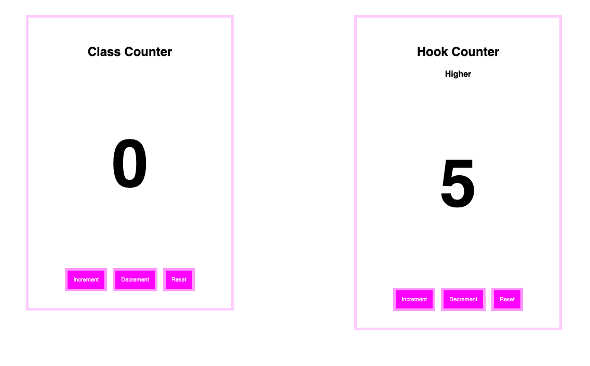

# State Management Counter

#### _React: State Management Counter, Last Update 04/13/2020_

## Description
Create a class component and React Hook counters.

## About this application
- There are two counters. One is made with React class component, the other one is made with React Hooks.

- Play and understand the difference between class component and functional component with Hooks.




## Installation:
1. Clone this repo:
```
$ git clone https://github.com/misakimichy/state-management-counter.git
```

2. Go to the root directory of the project and install yarn:

```
$ yarn
```

3. Run the project:
```
$ yarn run start 
```

4. Open up localhost:3080


## Known Bugs
- No known bugs at this time

## Support and contact details
I welcome any feedbacks and questions to misaki.koonce@gmail.com

## Technologies Used
Git, GitHub, Create React App, Yarn, SCSS, React and React Hooks

## License
Copyright © 2020 under the MIT License
